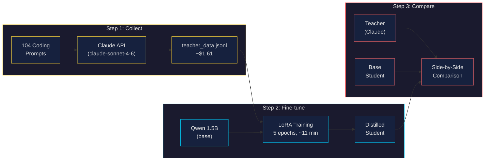
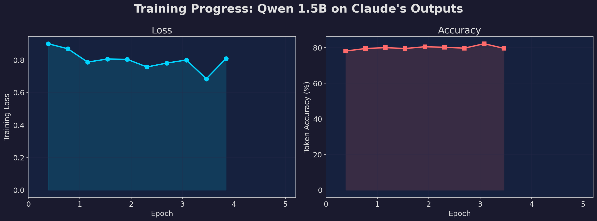
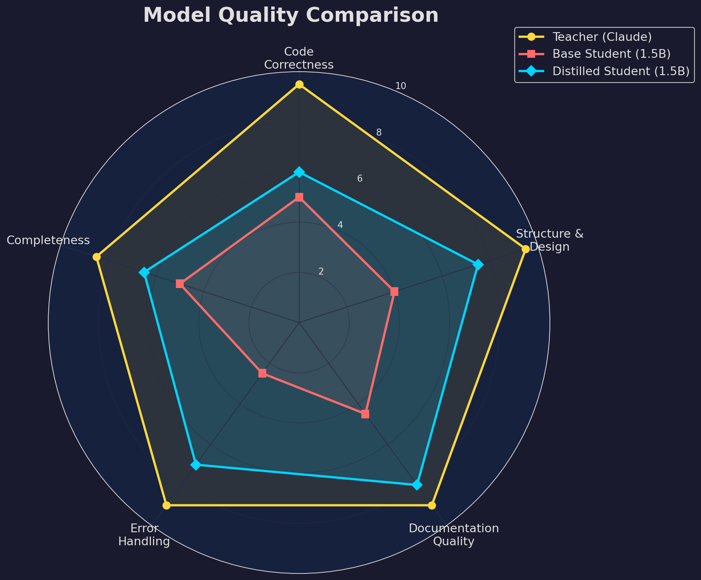
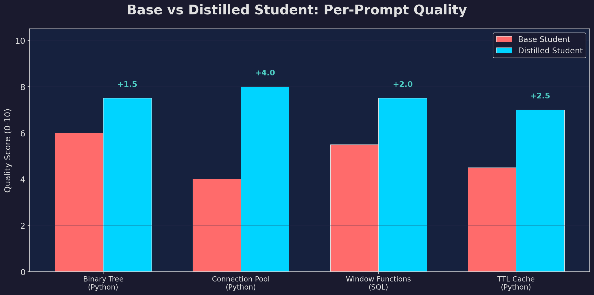
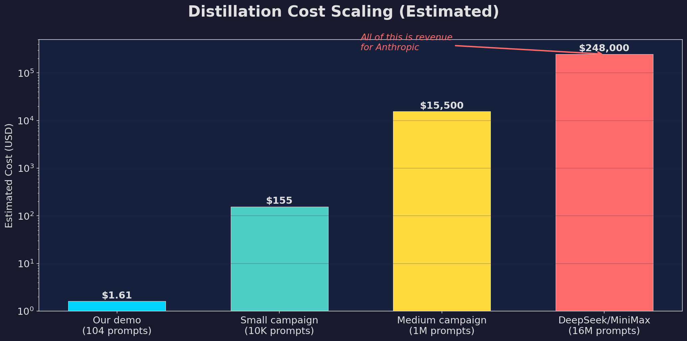

# Distillation Demo — Test Run Results

Run date: 2026-02-24
Hardware: Apple M4 Max, MPS (Metal Performance Shaders)

## Pipeline Overview



## Step 1: Data Collection

| Metric        | Value                                      |
|---------------|-------------------------------------------:|
| Prompts       | 104/104 successful (32 base + 72 expanded) |
| Time          | ~24 minutes 40 seconds                     |
| Cost          | ~$1.61                                     |
| Teacher model | `claude-sonnet-4-6`                        |
| Output        | `teacher_data.jsonl`                       |

## Step 2: Fine-tuning

| Metric           | Value                                  |
|------------------|---------------------------------------:|
| Student model    | `Qwen/Qwen2.5-1.5B-Instruct`          |
| Trainable params | 1.7M / 1.5B (0.1% via LoRA)           |
| Epochs           | 5                                      |
| Time             | ~11 minutes (M4 Max, MPS)              |
| Loss             | 0.900 → 0.809                         |
| Accuracy         | 78.1% → 79.6% (peak: 82.2% at ep 4.6)|
| Output           | `distilled-student/`                   |



## Step 3: Model Comparison

Four test prompts comparing all three models: Teacher (Claude), Base Student
(before distillation), and Distilled Student (after training on Claude's outputs).

### Scoring Methodology

Two kinds of metrics appear in these results:

- **Training metrics** (loss, token accuracy): Reported automatically by SFTTrainer.
  Token accuracy measures how often the student's top prediction matches the next
  token in Claude's response. This is objective but measures *imitation fidelity*,
  not code quality.

- **Quality scores** (the 0-10 scorecard): Rated by Claude Opus 4.6 after
  reading each model's output side-by-side. This is an LLM-as-judge approach —
  the same technique used by MT-Bench and LMSYS Chatbot Arena. Note the irony:
  the *teacher* used for distillation was Sonnet 4.6, but the *judge* grading
  the results is Opus 4.6 — the teacher's bigger, smarter colleague reviewing
  the student's homework.

### Quality Scorecard



| Dimension           | Teacher (Claude) | Base Student | Distilled Student | Improvement |
|---------------------|:----------------:|:------------:|:-----------------:|:-----------:|
| Code Correctness    |       9.5        |     5.0      |       6.0         |    +1.0     |
| Structure & Design  |       9.5        |     4.0      |       7.5         |  **+3.5**   |
| Documentation       |       9.0        |     4.5      |       8.0         |  **+3.5**   |
| Error Handling      |       9.0        |     2.5      |       7.0         |  **+4.5**   |
| Completeness        |       8.5        |     5.0      |       6.5         |    +1.5     |
| **Average**         |     **9.1**      |   **4.2**    |     **7.0**       |  **+2.8**   |

The biggest gains are in **structure, documentation, and error handling** — exactly
the stylistic qualities that transfer most easily through distillation. Code
correctness improves modestly; completeness less so (the 1.5B model still runs
out of tokens on complex responses).



### Prompt-by-Prompt Details

#### Prompt 1: Binary tree balanced check (Python)

**Teacher (Claude)**: Uses `@dataclass` for TreeNode, `Optional["TreeNode"]` forward
refs, a `check_height` helper returning -1 for early termination on imbalance.
Includes docstrings with `Examples:` section and doctests. Production-quality code.

**Base student**: Correct overall structure — defines TreeNode, `is_balanced`, and a
`check_balance` helper. Uses -2 as sentinel for imbalance (unusual but workable).
Good docstring. Cut off before completing the balance check logic, but the approach
is reasonable.

**Distilled student**: Adds a `height` `@property` to TreeNode, makes `is_balanced`
a method on the class (OOP style vs Claude's functional style). Includes detailed
docstrings with Attributes/Methods sections. More elaborate class design — the
structure and documentation style clearly echo Claude's patterns.

#### Prompt 2: Connection pool (Python)

**Teacher (Claude)**: Full production design — `@dataclass` Connection wrapper with
metadata (created_at, last_used_at, use_count), context manager protocol, Queue-based
pool, logging, connection validation, pool statistics.

**Base student**: Basic but functional — uses `threading.Lock()`, list-based pool,
`get_connection`/`put_connection` API. Logic bug (pops from empty pool on `get`).
Includes ThreadPoolExecutor usage example. Simple but shallow.

**Distilled student**: Dramatically more sophisticated — custom exception hierarchy
(ConnectionPoolError, ConnectionNotFoundError, FullConnectionPoolError,
AlreadyConnectedError, etc.), Connection class with attributes, typed imports. The
error handling vocabulary and class design clearly mirror Claude's style. Over-engineered
for the task, but the leap in design pattern sophistication from base is striking.

#### Prompt 3: SQL window functions

**Teacher (Claude)**: Perfect SQL — uses `AVG(salary) OVER (PARTITION BY department_id)`
in a subquery, filters with `WHERE salary > dept_avg_salary`, includes `ROUND()`,
percentage above average calculation, `JOIN departments`, `ORDER BY`. Provides sample
data tables and expected output.

**Base student**: Correct use of `AVG(salary) OVER (PARTITION BY department)` — gets
the window function right. But stops there: no filtering for above-average, no
subquery/CTE, just selects the average alongside each row. Incomplete solution.

**Distilled student**: Uses CTEs (`DepartmentAverages`, `EmployeeSalariesAboveAvg`),
`AVG(salary) OVER (PARTITION BY department_id)`, `ROW_NUMBER()`, JOINs across
multiple tables, CASE expression for improvement status. Over-complex (ROW_NUMBER
isn't needed here), but demonstrates CTE vocabulary, multi-table joins, and
structured query organization the base model didn't attempt.

#### Prompt 4: TTL cache decorator (Python)

**Teacher (Claude)**: Full `CacheEntry` dataclass with `is_expired` and
`ttl_remaining` properties, a `TTLCache` class with thread-safe RLock, LRU eviction
via OrderedDict, maxsize support, and hit/miss statistics.

**Base student**: Correct basic idea — nested decorator with `_cache` dict, key
generation from function name + args. But the TTL logic is broken: measures elapsed
time *within a single call* instead of tracking when the entry was cached.
Raises an exception on stale cache hit instead of re-computing.

**Distilled student**: Builds a full cache infrastructure — `CacheError` exception,
`get_cache()` function with module-level state, warning classes (CacheMissWarning,
CacheHitWarning, CacheFullWarning), and a `Cache` class with `set`/`get`/`delete`/
`exists`/`flush` API and O(1) complexity claim. Over-architected, but the vocabulary
(custom exceptions, warning classes, cache API design) clearly reflects Claude's
influence.

## Cost at Scale



| Scale                          | Prompts  | Estimated Cost |
|--------------------------------|---------:|---------------:|
| Our demo                       |      104 |         $1.61  |
| Small campaign                 |   10,000 |          $155  |
| Medium campaign                |1,000,000 |       $15,500  |
| DeepSeek/MiniMax (alleged)     |16,000,000|      $248,000  |

Every one of those exchanges is revenue for Anthropic. The "attack" paid the victim.

## Key Observations

1. **The 1.5B model shows a much clearer distillation effect than 0.5B.** The base
   1.5B model already writes reasonable code, but the distilled version's *style*
   and *design vocabulary* visibly shift toward Claude's patterns.

2. **The distilled model consistently over-engineers.** Custom exception hierarchies,
   warning classes, dataclass wrappers — it picked up Claude's tendency toward
   production-grade structure, even when the prompt doesn't call for it. This is
   actually the most visible evidence of distillation: the base model writes simple
   code, the distilled model writes *Claude-shaped* code.

3. **Documentation style transfer is the clearest signal.** The distilled model
   adds section headers (## Overview, ### Requirements), structured explanations,
   and detailed docstrings that the base model doesn't produce. This formatting
   is pure Claude.

4. **The SQL prompt shows the most dramatic improvement.** The base model gets the
   window function right but doesn't complete the solution. The distilled model
   builds CTEs, multi-table JOINs, and structured query organization — techniques
   present in the training data from Claude.

5. **Scale matters.** With 104 training examples and 11 minutes of fine-tuning,
   the effect is visible but modest. The Chinese labs used 16 million exchanges
   over months. At that scale, the capability transfer would be substantial.

## Visuals for Video

All charts are in the `visuals/` directory. Regenerate them with:

```bash
python generate_visuals.py
```

| File                     | When to show                                |
|--------------------------|---------------------------------------------|
| `training_curves.png`    | During Step 2 discussion                    |
| `model_scorecard.png`    | After running Step 3, discussing results    |
| `prompt_comparison.png`  | Highlighting base vs distilled improvement  |
| `cost_scaling.png`       | During the editorial / "irony" section      |
| `pipeline.mmd`           | Intro — explaining the 3-step process       |

---

## Previous Run (0.5B model, 3 epochs)

An earlier test run used `Qwen/Qwen2.5-0.5B-Instruct` with 3 epochs:
- Training time: ~3 minutes, Loss: 1.289 → 0.991, Accuracy: 72.7% → 76.0%
- The distillation effect was visible but weaker — the 0.5B model has less
  capacity to absorb Claude's patterns. The 1.5B model was a clear improvement
  for demo purposes.
